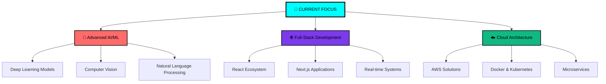

<div align="center">


<br/>

**`⟨ Computer Engineering Student @ University of Ruhuna ⟩`**

<br/>

<a href="https://www.linkedin.com/in/upeka-diluksha">
  
</a>
<a href="mailto:dilukshaupeka@gmail.com">
  
</a>
<a href="https://portfolio-vtng.onrender.com/">
  
</a>

</div>

---

<div align="center">

## ⟨ NEURAL NETWORK INITIALIZED ⟩

</div>

```python
class UpekaDiluksha:
    def __init__(self):
        self.name = "Upeka Diluksha"
        self.role = "Digital Architect & AI Engineer"
        self.location = "🌍 Sri Lanka"
        self.education = "B.Sc. Computer Engineering"
        
        self.tech_stack = {
            "languages": ["Python", "JavaScript", "TypeScript", "Java"],
            "ai_ml": ["TensorFlow", "PyTorch", "OpenCV", "Scikit-learn"],
            "frontend": ["React", "Next.js", "React Native"],
            "backend": ["Node.js", "Express", "FastAPI", "MongoDB"],
            "cloud": ["AWS", "Docker", "Kubernetes", "Firebase"],
            "tools": ["Git", "VS Code", "Figma", "Postman"]
        }
        
        self.current_mission = [
            "🧠 Mastering Advanced AI Algorithms",
            "🚀 Building Scalable Applications", 
            "🔬 Contributing to Open Source",
            "💡 Solving Real-world Problems"
        ]
    
    def get_status(self):
        return "🟢 Available for collaboration and exciting opportunities"
    
    def execute_vision(self):
        return "Transforming ideas into intelligent digital solutions"

upeka = UpekaDiluksha()
print(f"Status: {upeka.get_status()}")
```

---

<div align="center">

## ⟨ TECHNOLOGY MATRIX ⟩

</div>

<div align="center">

<table>
<tr>
<td align="center">

<br/><br/>


<!--  -->


</td>
<td align="center">

<br/><br/>


</td>
</tr>
<tr>
<td align="center">

<br/><br/>


<!--  -->

</td>
<td align="center">

<br/><br/>


<!--  -->
</td>
</tr>
<tr>
<td align="center" colspan="2">

<br/><br/>


<!--  -->
</td>
</tr>
</table>

</div>

---

<div align="center">

## ⟨ PROJECT PORTFOLIO ⟩

</div>

<div align="center">

<table>
<tr>
<td width="50%" align="center">

### 🔋 **EV CHARGING NEXUS**
*Next-Gen Charging Station Management*


<br/><br/>

**⚡ TECH ARCHITECTURE**
```
React Native ⟩ Node.js ⟩ MongoDB
Socket.io ⟩ Stripe API ⟩ JWT
```

**🎯 CORE FEATURES**
- `🔴 Real-time Station Tracking`
- `💳 Quantum Payment Processing`
- `🧠 AI Route Optimization`
- `📱 Cross-platform Interface`
- `⚡ Instant Notifications`

</td>
<td width="50%" align="center">

### 💬 **LIVE TALK MATRIX**
*Encrypted Communication Platform*


<br/><br/>

**⚡ TECH ARCHITECTURE**
```
React ⟩ Node.js ⟩ Socket.io
Redis ⟩ MongoDB ⟩ JWT Auth
```

**🎯 CORE FEATURES**
- `🔐 End-to-End Encryption`
- `⚡ Quantum-speed Messaging`
- `📎 Secure File Transfer`
- `👥 Multi-user Channels`
- `🌐 Global Presence System`

</td>
</tr>
</table>

</div>

---

<div align="center">

## ⟨ NEURAL PATHWAYS ⟩

</div>

<div align="center">



</div>

---

<div align="center">

## ⟨ MISSION PARAMETERS ⟩

</div>

<div align="center">

<table>
<tr>
<td align="center" width="33%">

<br/><br/>
<b>🚀 Architect the Future</b>
<br/>
<i>Building intelligent systems that reshape how humans interact with technology</i>
</td>
<td align="center" width="33%">

<br/><br/>
<b>⚡ Code with Purpose</b>
<br/>
<i>Transforming complex problems into elegant, scalable digital solutions</i>
</td>
<td align="center" width="33%">

<br/><br/>
<b>🎯 Innovation Drive</b>
<br/>
<i>Pushing boundaries through continuous learning and creative problem-solving</i>
</td>
</tr>
</table>

</div>

---

<div align="center">

## ⟨ COLLABORATION PROTOCOL ⟩

<br/>

**🔍 SEEKING CONNECTIONS FOR:**

`🤖 AI/ML Research Projects` • `🌐 Full-Stack Development` • `🚀 Startup Ventures` • `🔬 Open Source Initiatives`

<br/>

**⚡ READY TO ENGAGE IN:**

`💡 Innovation Labs` • `🏢 Tech Internships` • `🌟 Hackathons` • `🤝 Research Collaborations`

<br/>

---

<br/>

<a href="https://www.linkedin.com/in/diluksha-upeka">
  
</a>
<a href="mailto:dilukshaupeka@gmail.com">
  
</a>

<br/><br/>

---

<br/>

**`⟨ "The future belongs to those who believe in the beauty of their dreams." ⟩`**
**— Eleanor Roosevelt**

<br/>

---


</div>
